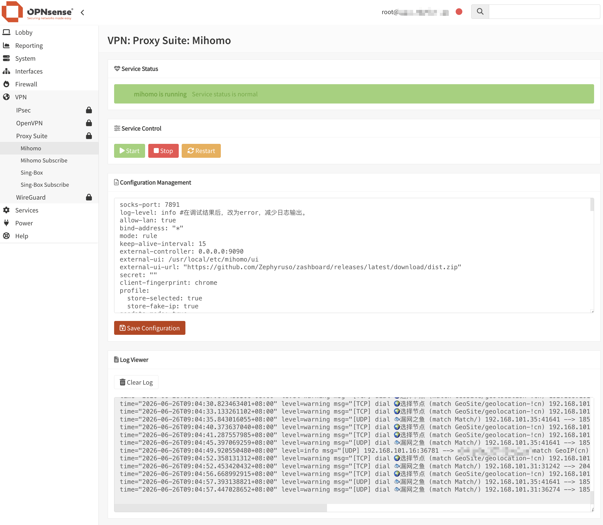

<div align="center">
  <a href="README.md">中文</a> |
  <a href="README.US.md">English</a>
</div>

# Mihomo for OPNsense


Mihomo, formerly Clash Meta, is a high-performance open source proxy core compatible with Clash configuration files. It provides rule-based routing, DNS handling, load balancing, and transparent proxy support.

This project packages Mihomo as an OPNsense plugin so it can run on OPNsense and provide transparent proxy functionality through the OPNsense WebGUI.

Tested on:

- OPNsense 25.1



## Binary

The project uses the static binary from [Vincent-Loeng](https://github.com/Vincent-Loeng/clash-meta). The default local asset path is:

```text
bin/clash-meta-freebsd-amd64.xz
```

The build script prefers the local `bin/clash-meta-freebsd-amd64.xz` file. If it is missing, the script downloads it from GitHub:

```text
https://github.com/Vincent-Loeng/clash-meta/releases/latest/download/clash-meta-freebsd-amd64.xz
```

## Notes

1. Only x86_64 / amd64 is currently supported.
2. After installation, no interface or firewall rule needs to be added manually. Edit the node information in the default configuration and use it directly.
3. After debugging is complete, set the log level to `error` to avoid excessive long-term logs.
4. The default configuration enables the Clash API. You can open the dashboard at `http://LAN_IP:9090/ui`.
5. Do not change the TUN interface name `tun_mihomo` in `config.yaml`, otherwise the installer-generated firewall rules may stop matching.
6. If a LAN client uses the OPNsense LAN address as its DNS server, Unbound processes queries locally before they reach mihomo. To ensure mihomo handles DNS queries, you can redirect LAN DNS traffic via NAT, assign an external DNS server to clients via DHCP, or enable query forwarding in Unbound. This installation package configures Unbound to forward queries to port 1053 (the port mihomo listens on) and applies a `geosite:cn` filter to the Fake-IP mechanism; this ensures that domestic domains resolve to their actual IP addresses, while foreign domains utilize Fake-IPs.

## Install

Upload the package to OPNsense and run:

```sh
pkg add -f os-mihomo.pkg
```

After installation, refresh the OPNsense WebGUI and go to:

```text
Services > Mihomo
```

## Uninstall

```sh
pkg delete os-mihomo
```

## Subscription Updates

Automatic subscription updates can be scheduled with Cron:

```text
System > Settings > Cron
```

Add a scheduled task and select:

```text
Renew mihomo Subscription
```

## Build pkg

Build on a FreeBSD or OPNsense host. The following commands are required:

```sh
pkg, tar, make, xz, curl or fetch
```

Run:

```sh
make package ABI=universal
```

Output file:

```text
dist/os-mihomo.pkg
```

Inspect package metadata:

```sh
pkg info -F dist/os-mihomo.pkg
```

## Common Commands

Service control:

```sh
service mihomo start
service mihomo stop
service mihomo status
service mihomo restart
service mihomo rcvar
```

View logs:

```sh
tail -f /var/log/mihomo.log
```

Check listening ports:

```sh
sockstat -4 -l | egrep ':53|:7891|:9090'
```

Check the TUN interface:

```sh
ifconfig tun_mihomo
```

Check runtime firewall rules:

```sh
pfctl -sr | grep -E 'tun_mihomo'
```

## Credits

[MetaCubeX](https://github.com/MetaCubeX/mihomo)<br>
[Vincent-Loeng](https://github.com/Vincent-Loeng?tab=repositories)

## Disclaimer

> [!CAUTION]
> This is an unofficial plugin and is not supported by the OPNsense team. Use it at your own risk.
