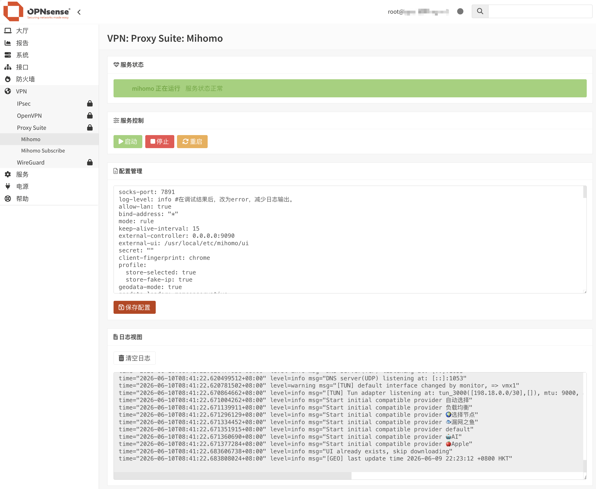

<div align="center">
  <a href="README.md">中文</a> |
  <a href="README.US.md">English</a>
</div>

# Mihomo for OPNsense


Mihomo（原 Clash Meta）是一款高性能、功能丰富的开源代理核心，兼容 Clash 配置格式，并在此基础上扩展了更多协议和高级功能，支持多种代理协议，提供灵活的规则分流、DNS 管理、负载均衡和透明代理功能。凭借其优秀的性能和广泛的兼容性，Mihomo 已成为构建现代网络代理和流量管理解决方案的重要工具之一。

本项目是一个用于 OPNsense 的 Mihomo 插件，用于在 OPNsense 上运行 Mihomo 并实现透明代理功能。

在以下环境测试通过：

- OPNsense 26.1.9



## 项目程序

项目使用 [Vincent-Loeng](https://github.com/Vincent-Loeng/clash-meta) 静态二进制文件，文件路径如下：
```text
bin/clash-meta-freebsd-amd64.xz
```
构建脚本会优先使用本地 `bin/clash-meta-freebsd-amd64.xz` 文件。如果本地文件不存在，会从 Github 下载：
```text
https://github.com/Vincent-Loeng/clash-meta/releases/latest/download/clash-meta-freebsd-amd64.xz
```

## 注意事项

1. 当前仅支持 x86_64 / amd64 平台。
2. 安装完成，无需添加接口、防火墙规则，只需修改节点信息即可使用。
3. 安装调试完成后，将日志层级调整为 `error`，避免长期运行产生过多日志。
4. 默认配置会开启 Clash API，可通过 `http://LAN_IP:9090/ui` 访问仪表盘查看代理连接信息。
5. 修改配置不要改动config.yaml文件中tun接口名称（tun_mihomo），否则会影响安装程序生成的默认防火墙规则。
6. 如果局域网客户端使用 OPNsense 的 LAN 地址作为 DNS，Unbound 会在请求到达 mihomo 之前在本地处理查询。若要让 mihomo 接管 DNS 查询，可以通过 NAT 重定向局域网的 DNS 流量，或者通过 DHCP 为客户端指定一个外部 DNS 服务器，或者启用 Unbound 的查询转发来解决。本安装包通过在 Unbound 添加一个指向1053（mihomo监听端口）端口的转发来处理本地查询，同时在Fake-IP增加geosite:cn过滤，实现国内域名返回真实IP，国外域名使用Fake-IP。

## 安装命令

将安装包上传到 OPNsense 后执行：
```sh
pkg add -f os-mihomo.pkg
```
安装完成后刷新 OPNsense WebGUI，进入：
```text
VPN > Mihomo
```
## 卸载命令
```sh
pkg delete os-mihomo
```
## 订阅更新
自动更新订阅可通过 Cron 完成：
```text
转到 系统>设置>任务
```
添加定时任务，在命令项，找到以下命令并添加：
```sh
Renew mihomo Subscription
```
## 编译 pkg
在 FreeBSD 或 OPNsense 主机上构建。需要以下命令：
```sh
pkg、tar、make、xz、curl 或 fetch
```
运行：

```sh
make package
```
生成文件：

```text
dist/os-mihomo.pkg
```
检查包元数据：
```sh
pkg info -F dist/os-mihomo.pkg
```
## 常用命令
服务控制：
```sh
service mihomo start
service mihomo stop
service mihomo status
service mihomo restart
service mihomo rcvar
```
查看日志：
```sh
tail -f /var/log/mihomo.log
```
检查监听端口：
```sh
sockstat -4 -l | egrep ':53|:7891|:9090'
```
检查 TUN 接口：
```sh
ifconfig tun_mihomo
```
检查防火墙运行规则：
```sh
pfctl -sr | grep -E 'tun_mihomo'
```
## 致谢
[MetaCubeX](https://github.com/MetaCubeX/mihomo)<br>
[Vincent-Loeng](https://github.com/Vincent-Loeng?tab=repositories)

## 免责声明
> [!CAUTION]
> 非官方插件，无 OPNsense 团队支持。使用者自行承担一切后果。
