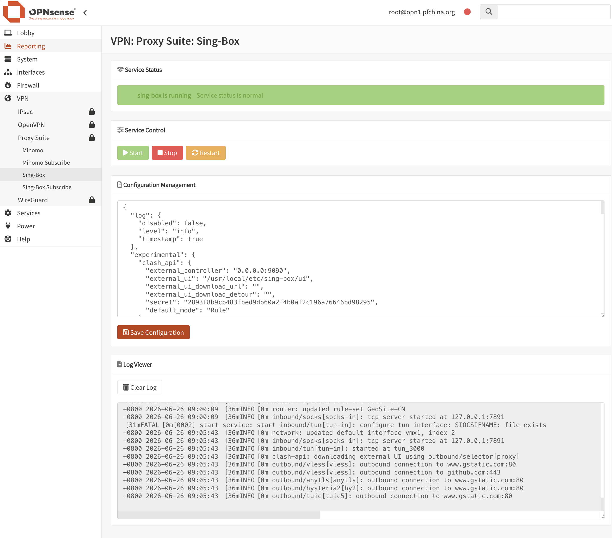

<div align="center">
  <a href="README.md">中文</a> |
  <a href="README.US.md">English</a>
</div>

# Sing-Box for OPNsense


sing-box is a powerful, high-performance open source proxy platform that supports many mainstream proxy protocols. It can be used for proxying, traffic routing, load balancing, and secure access scenarios.

This project integrates sing-box into the OPNsense WebGUI with transparent proxy support, configuration editing, service management, status monitoring, and log viewing.

Tested on:

- OPNsense 26.1.9



## Binary

The project uses the static binary from [Vincent-Loeng](https://github.com/Vincent-Loeng/bsd-box). The default local asset path is:

```text
bin/bsd-box-reF1nd-freebsd-amd64.xz
```

The build script prefers the local `bin/bsd-box-reF1nd-freebsd-amd64.xz` file. If it is missing, the script downloads it from GitHub:

```text
https://github.com/Vincent-Loeng/bsd-box/releases/latest/download/bsd-box-reF1nd-freebsd-amd64.xz
```

## Notes

1. Only x86_64 / amd64 is currently supported.
2. After installation, no interface or firewall rule needs to be added manually. Edit the node information and use it directly.
3. After debugging is complete, set the log level to `error` to avoid excessive long-term logs.
4. Configuration formats may differ between versions. The default configuration in each release is only guaranteed to match the bundled package version.
5. The default configuration enables the Clash API. You can open the dashboard at `http://LAN_IP:9091/ui`.
6. Do not change the TUN interface name `tun_singbox` in `config.json`, otherwise the installer-generated firewall rules may stop matching.
7. If LAN clients use OPNsense as their DNS resolver, Unbound will process queries locally before they reach sing-box. To have sing-box handle DNS rules, you can redirect LAN DNS traffic via NAT/rdr, configure Unbound to forward queries, or assign an external DNS server to clients via DHCP. You only need to use one of these methods.

To redirect DNS queries, navigate to Firewall > NAT > Port Forward and add the following rule:

```text
- Interface: LAN
- Version: IPv4
- Protocol: TCP/UDP
- Destination Address: This Firewall
- Destination Port: 53
- Redirect Target: 1.1.1.1 or other public DNS
- Redirect Target Port: DOMAIN (53)
```
To add Unbound query forwarding, you need to add an inbound configuration to `config.json`:
```text
    {
      "type": "direct",
      "tag": "dns-in",
      "listen": "127.0.0.1",
      "listen_port": 5353,
      "override_address": "8.8.8.8",
      "override_port": 53
    },
```
Then, under Services > Unbound DNS > Query Forwarding, add a forwarding record pointing to port 5353 and apply the changes:

```text
- Enable: Checked
- Domain: Leave blank
- Server IP: 127.0.0.1
- Server Port: 5353
```

## Install

Upload the package to OPNsense and run:

```sh
pkg add -f os-sing-box.pkg
```

Refresh the OPNsense WebGUI and go to:

```text
Services > Sing-Box
```

## Uninstall

```sh
pkg delete os-sing-box
```

## Subscription Updates

Automatic subscription updates can be scheduled with Cron:

```text
System > Settings > Cron
```

Add a scheduled task and select:

```text
Renew sing-box Subscription
```

## Build pkg

Build on a FreeBSD host. Required commands:

```sh
pkg, tar, make, xz, curl or fetch
```

Run:

```sh
make package ABI=universal
```

Output file:

```text
dist/os-sing-box.pkg
```

Inspect package metadata:

```sh
pkg info -F dist/os-sing-box.pkg
```

## Common Commands

Service control:

```sh
service sing-box start
service sing-box stop
service sing-box status
service sing-box restart
service sing-box rcvar
```

Configuration validation:

```sh
sing-box check -c /usr/local/etc/sing-box/config.json
```

View logs:

```sh
tail -f /var/log/sing-box.log
```

Check listening ports:

```sh
sockstat -4 -l | egrep ':53|:7892|:9091'
```

Check the TUN interface:

```sh
ifconfig tun_singbox
```

Check runtime firewall rules:

```sh
pfctl -sr | grep -E 'tun_singbox'
```

## Credits

[SagerNet](https://github.com/SagerNet/sing-box)<br>
[Vincent-Loeng](https://github.com/Vincent-Loeng?tab=repositories)

## Disclaimer

> [!CAUTION]
> This is an unofficial plugin and is not supported by the OPNsense team. Use it at your own risk.
