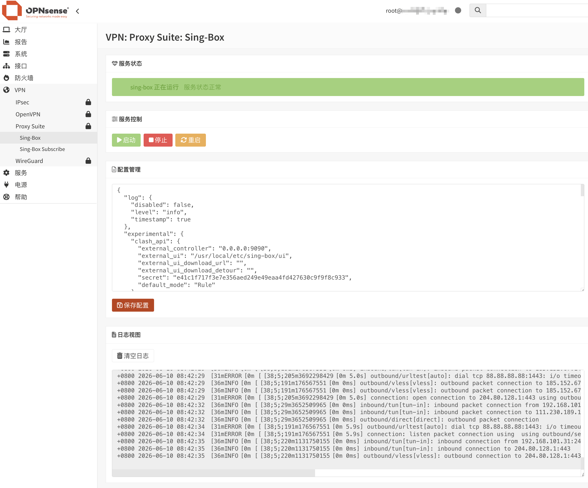

<div align="center">
  <a href="README.md">中文</a> |
  <a href="README.US.md">English</a>
</div>

# Sing-Box for OPNsense


sing-box 是一款功能强大、性能优秀的开源网络代理平台，支持多种主流代理协议。它基于现代化架构设计，具备高性能、低资源占用和灵活配置等特点，可用于网络代理、流量分流、负载均衡以及安全访问等场景。

本项目将 sing-box 无缝集成到 OPNsense WebUI，支持透明代理，并提供配置编辑、服务管理、状态监控和日志查看等功能，使用户能够通过图形界面轻松管理 sing-box。

已在以下环境测试通过：

- OPNsense 26.1.9



## 项目程序

项目使用 [Vincent-Loeng](https://github.com/Vincent-Loeng/bsd-box) 静态二进制文件，默认文件路径如下：
```text
bin/bsd-box-reF1nd-freebsd-amd64.xz
```
构建脚本会优先使用本地 `bin/bsd-box-reF1nd-freebsd-amd64.xz` 文件。如果本地文件不存在，会从 Github 下载：
```text
https://github.com/Vincent-Loeng/bsd-box/releases/latest/download/bsd-box-reF1nd-freebsd-amd64.xz
```
## 注意事项

1. 当前仅支持 x86_64 / amd64 平台。
2. 安装完成，无需添加接口、防火墙规则。只需修改节点信息即可使用。
3. 安装调试完成后，将日志层级调整为 `error`，避免长期运行产生过多日志。
4. 不同版本之间配置格式可能存在差异，Release 中的默认配置仅保证匹配当前安装包内置版本。
5. 默认配置会开启 Clash API，可通过 `http://LAN_IP:9091/ui` 访问仪表盘查看代理连接信息。
6. 修改配置不要改动config.json文件中tun接口名称（tun_singbox），否则会影响安装程序生成的默认防火墙规则。
7. 如果局域网客户端使用 OPNsense 作为 DNS，Unbound 会在请求到达 sing-box 之前在本地 Unbound 处理查询。若要让 sing-box 接管 DNS 规则，可以通过 NAT/rdr 重定向局域网的 DNS 流量，或者 Unbound 添加查询转发，或者通过 DHCP 为客户端指定一个外部 DNS 服务器。三种方法使用一种即可。

采用重定向 DNS 查询，导航到防火墙>NAT>目标 NAT，添加如下规则：

```text
- 接口: LAN
- 协议: TCP/UDP
- 目标: 该防火墙
- 目标端口: 53
- 重定向目标: 1.1.1.1 或其他公共DNS地址
- 重定向目标端口: 53
```
添加 Unbound 查询转发，需要在config.json中增加入站：
```text
    {
      "type": "direct",
      "tag": "dns-in",
      "listen": "127.0.0.1",
      "listen_port": 5353,
      "override_address": "8.8.8.8",
      "override_port": 53
    },
```
然后在服务>Unbound DNS>查询转发，添加指向 5353 端口的转发记录并应用：

```text
- 启用: 选中
- 域: 留空
- 服务器IP: 127.0.0.1
- 服务器端口: 5353
```

## 安装命令
将安装包上传到 OPNsense 后执行：
```sh
pkg add -f os-sing-box.pkg
```
刷新 OPNsense WebGUI，进入：
```text
VPN > Sing-Box
```
## 卸载命令
```sh
pkg delete os-sing-box
```
## 订阅更新
自动更新订阅可通过 Cron 完成：
```text
转到 系统>设置>任务
```
添加定时任务，在命令项，找到以下命令并添加：
```sh
Renew sing-box Subscription
```
## 编译 pkg
在 FreeBSD 主机上构建。需要以下命令：
```sh
pkg、tar、make、xz、curl 或 fetch
```
运行：

```sh
make package
```
生成文件：

```text
dist/os-sing-box.pkg
```
检查包元数据：
```sh
pkg info -F dist/os-sing-box.pkg
```
## 常用命令
服务控制：
```sh
service sing-box start
service sing-box stop
service sing-box status
service sing-box restart
service sing-box rcvar
```
配置校验：

```sh
sing-box check -c /usr/local/etc/sing-box/config.json
```
查看日志：

```sh
tail -f /var/log/sing-box.log
```
检查监听端口：

```sh
sockstat -4 -l | egrep ':53|:7892|:9091'
```
检查 TUN 接口：

```sh
ifconfig tun_singbox
```
检查防火墙运行时规则：

```sh
pfctl -sr | grep -E 'tun_singbox'
```
## 致谢
[SagerNet](https://github.com/SagerNet/sing-box)<br>
[Vincent-Loeng](https://github.com/Vincent-Loeng?tab=repositories)

## 免责声明
> [!CAUTION]
> 非官方插件，无 OPNsense 团队支持。使用者自行承担一切后果。
